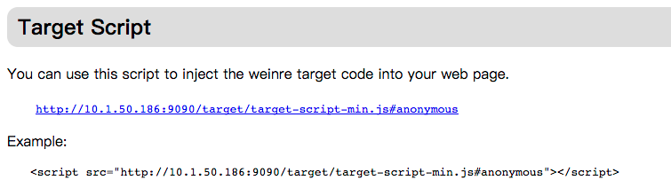
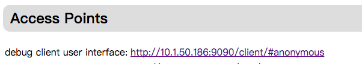
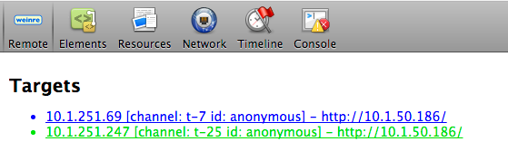

npm install -g weinre

weinre --debug true --verbose true  --httpPort 9090  --boundHost 10.1.50.186

打开http://10.1.50.186:9090/
将页面中html代码的嵌入要调试的h5文件
```
Example:
<script src="http://10.1.50.186:9090/target/target-script-min.js#anonymous"></script>
```


嵌入之后手机打开被调试页面会在http://10.1.50.186:9090/出现调试设备，点击链接进入


点击Elements进行调试


多用户
http://10.1.50.186:9090/#ljtest
